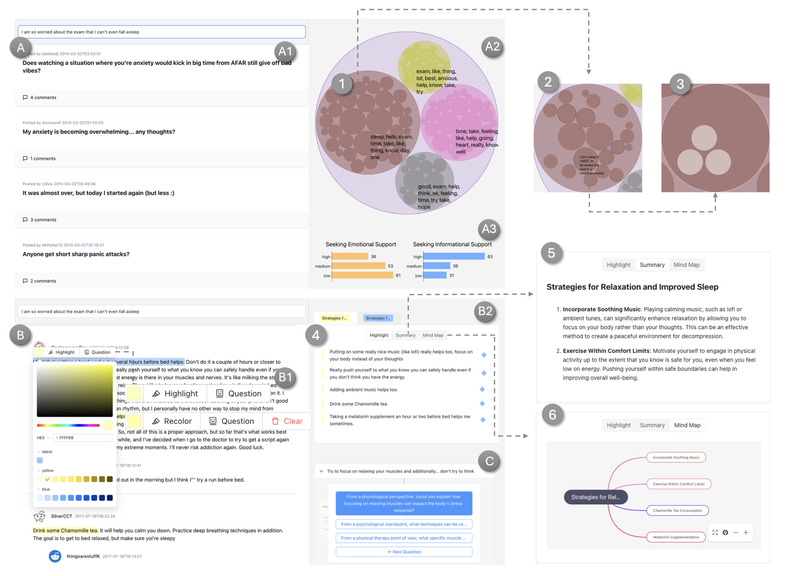
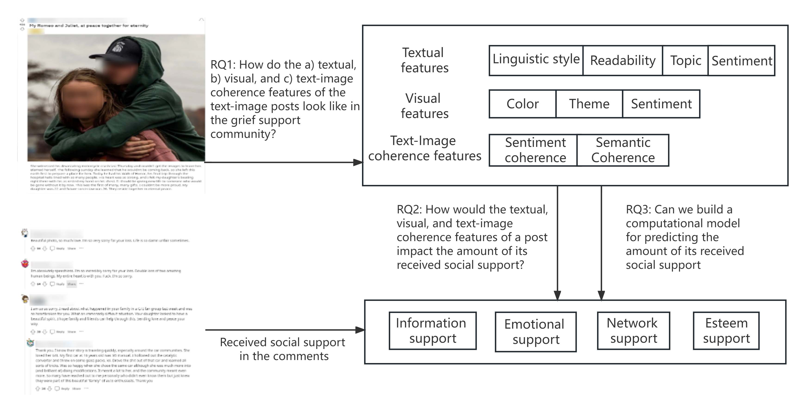








Hi, I'm Shiwei Wu, a second-year Master student at the School of Artificial Intelligence at Sun Yat-sen University (SYSU), supervised by Prof. Zhenhui Peng. Currently my research focuses on **Creativity Support, Human-AI Collabration, Conversational Search, and Visualization**.

# 🔥 News
- *2022.02*: &nbsp;🎉🎉 Lorem ipsum dolor sit amet, consectetur adipiscing elit. Vivamus ornare aliquet ipsum, ac tempus justo dapibus sit amet. 
- *2022.02*: &nbsp;🎉🎉 Lorem ipsum dolor sit amet, consectetur adipiscing elit. Vivamus ornare aliquet ipsum, ac tempus justo dapibus sit amet. 

# 📝 Publications 

CSCW 2025

[ComViewer: An Interactive Visual Tool to Help Viewers Seek Social Support in Online Mental Health Communities]([https://arxiv.org/pdf/2411.19169])

**Shiwei Wu**, Mingxiang Wang, Chuhan Shi, and Zhenhui Peng

[**Project**](https://github.com/ShionMing/ComViewer) <strong></strong>
- Lorem ipsum dolor sit amet, consectetur adipiscing elit. Vivamus ornare aliquet ipsum, ac tempus justo dapibus sit amet. 

CSCW 2025

[Exploring the Usage of Generative AI for Group Project-Based Offline Art Courses in Elementary Schools.]([https://arxiv.org/pdf/2411.19169])

Zhiqing Wang, Haoxiang Fan, Qiaoyi Chen, **Shiwei Wu**, Yongqi Liang, and Zhenhui Peng

[**Project to appear**](https://github.com/ShionMing/ComViewer) <strong></strong>
- Lorem ipsum dolor sit amet, consectetur adipiscing elit. Vivamus ornare aliquet ipsum, ac tempus justo dapibus sit amet. 

ICWSM 2024

[Understanding the Features of Text-Image Posts and Their Received Social Support in Online Grief Support Communities.]([https://ojs.aaai.org/index.php/ICWSM/article/view/31362/33522])

Shuailin Li, **Shiwei Wu**, Tianjian Liu, Han Zhang, Qingyu Guo, and Zhenhui Peng

[**Project to appear**](https://github.com/ShionMing/ComViewer) <strong></strong>
- Lorem ipsum dolor sit amet, consectetur adipiscing elit. Vivamus ornare aliquet ipsum, ac tempus justo dapibus sit amet. 

# 🎖 Honors and Awards
- *2021.10* Lorem ipsum dolor sit amet, consectetur adipiscing elit. Vivamus ornare aliquet ipsum, ac tempus justo dapibus sit amet. 
- *2021.09* Lorem ipsum dolor sit amet, consectetur adipiscing elit. Vivamus ornare aliquet ipsum, ac tempus justo dapibus sit amet. 

# 📖 Educations
- *2019.06 - 2022.04 (now)*, Lorem ipsum dolor sit amet, consectetur adipiscing elit. Vivamus ornare aliquet ipsum, ac tempus justo dapibus sit amet. 
- *2015.09 - 2019.06*, Lorem ipsum dolor sit amet, consectetur adipiscing elit. Vivamus ornare aliquet ipsum, ac tempus justo dapibus sit amet. 

# 💬 Invited Talks
- *2021.06*, Lorem ipsum dolor sit amet, consectetur adipiscing elit. Vivamus ornare aliquet ipsum, ac tempus justo dapibus sit amet. 
- *2021.03*, Lorem ipsum dolor sit amet, consectetur adipiscing elit. Vivamus ornare aliquet ipsum, ac tempus justo dapibus sit amet.  \| [\[video\]](https://github.com/)

# 💻 Internships
- *2019.05 - 2020.02*, [Lorem](https://github.com/), China.
